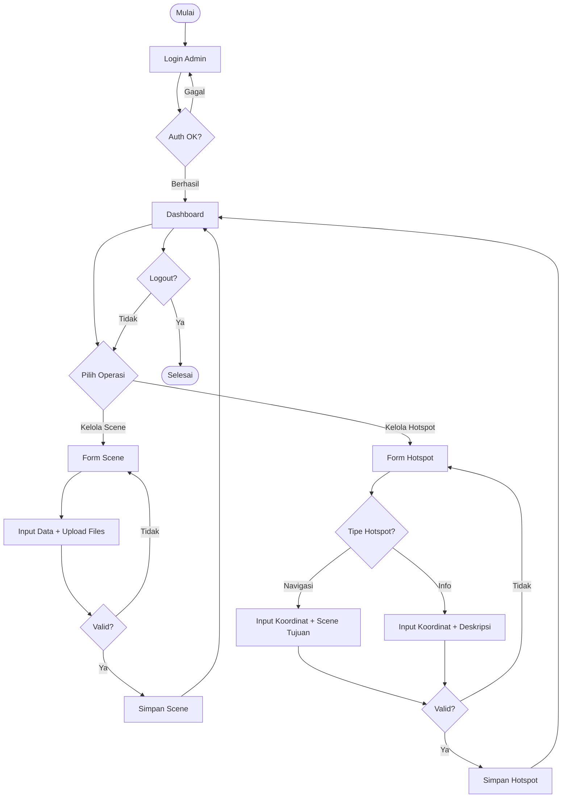

# Activity Diagram - Administrator (Ringkas)

## Alur Kerja Administrator

Pengelolaan konten virtual tour: Scene (lokasi 360°) dan Hotspot (navigasi/info).

---

## Flowchart Diagram

---

## Penjelasan Singkat

### 1. Login
- Akses `/admin/` → input username & password
- Validasi → berhasil ke dashboard, gagal retry
- Keamanan: PBKDF2, CSRF protection, session-based

### 2. Kelola Scene
**Input:**
- Title, Description, Building, Floor

**Upload:**
- Panorama 360° (JPG/PNG, max 10MB, ratio 2:1)
- Thumbnail (JPG/PNG, max 5MB, ratio 16:9)
- Validasi: gagal retry, berhasil lanjut

**Metadata:**
- Published date, author, is_active, is_featured
- Submit → validasi → simpan + generate slug

### 3. Kelola Hotspot
**Navigasi:**
- Pitch & yaw (koordinat: -90° hingga 90°, -180° hingga 180°)
- Pilih scene tujuan (WAJIB)
- Input label → simpan dengan foreign key

**Info Point:**
- Pitch & yaw
- Label & deskripsi → simpan (to_scene = NULL)

### 4. Loop
- Loop hotspot: tambah multiple per scene
- Loop operasi: CRUD lainnya
- Exit: logout

---

## Decision Points

| Decision | Success | Failure |
|----------|---------|---------|
| Validasi Auth | Dashboard | Error → retry |
| Validasi File | Lanjut | Error → retry |
| Validasi Form | Simpan | Error → form |
| Tambah Hotspot? | Pilih scene | Operasi lain |
| Tipe Hotspot | 2 paths | - |

---

## Estimasi Waktu

| Aktivitas | Waktu |
|-----------|-------|
| Create 1 scene | ~3-5 menit |
| Create 1 hotspot | ~1-2 menit |
| **Total (1 scene + 3 hotspots)** | **~8-12 menit** |

---

**Generated:** December 23, 2025  
**Role:** Administrator  
**System:** Virtual Tour UNU Yogyakarta
