# Use Case Diagram - Virtual Tour UNU Yogyakarta

## Use Case Diagram

```mermaid
graph TB
    subgraph System["Virtual Tour UNU Yogyakarta System"]
        UC1[Login ke Admin Panel]
        UC2[Mengelola Scene/Lokasi]
        UC2a[Tambah Scene Baru]
        UC2b[Edit Scene]
        UC2c[Hapus Scene]
        UC2d[Upload Foto 360°]
        UC3[Mengelola Hotspot]
        UC3a[Tambah Hotspot Navigasi]
        UC3b[Tambah Info Point]
        UC3c[Edit Hotspot]
        UC3d[Hapus Hotspot]
        UC4[Mengatur Multi-Floor Navigation]
        UC5[Melihat Daftar Lokasi]
        UC6[Memilih Scene/Lokasi]
        UC7[Navigasi 360° View]
        UC7a[Drag untuk Rotasi]
        UC7b[Zoom In/Out]
        UC7c[Fullscreen]
        UC8[Klik Hotspot Navigasi]
        UC9[Melihat Info Point]
        UC10[Browse Thumbnail Gallery]
        UC11[Share Virtual Tour]
    end
    
    Admin([Admin])
    Pengunjung([Pengunjung])
    
    Admin -.-> UC1
    Admin -.-> UC2
    Admin -.-> UC3
    Admin -.-> UC4
    
    UC2 -.include.-> UC2a
    UC2 -.include.-> UC2b
    UC2 -.include.-> UC2c
    UC2 -.include.-> UC2d
    
    UC3 -.include.-> UC3a
    UC3 -.include.-> UC3b
    UC3 -.include.-> UC3c
    UC3 -.include.-> UC3d
    
    Pengunjung -.-> UC5
    Pengunjung -.-> UC6
    Pengunjung -.-> UC7
    Pengunjung -.-> UC8
    Pengunjung -.-> UC9
    Pengunjung -.-> UC10
    Pengunjung -.-> UC11
    
    UC7 -.include.-> UC7a
    UC7 -.include.-> UC7b
    UC7 -.include.-> UC7c
    
    UC6 -.extend.-> UC10
```



---

## Actors (Aktor)

### 1. **Admin** 🔐
**Deskripsi:** Administrator sistem yang mengelola konten virtual tour.

**Karakteristik:**
- Memiliki akses ke Django Admin Panel
- Bertanggung jawab untuk upload dan mengelola konten
- Dapat mengatur navigasi dan hotspot

**Hak Akses:**
- Login ke admin panel
- CRUD (Create, Read, Update, Delete) Scene
- CRUD Hotspot
- Upload media files (panorama & thumbnail)

---

### 2. **Pengunjung** 👤
**Deskripsi:** Pengguna umum yang mengakses virtual tour melalui web browser.

**Karakteristik:**
- Tidak perlu login
- Dapat mengakses semua scene aktif
- Interaksi read-only (tidak bisa mengubah konten)

**Hak Akses:**
- Melihat dan menavigasi semua scene aktif
- Mengakses info point
- Menggunakan fitur-fitur viewer (zoom, fullscreen, dll)

---

## Use Cases Detail

### 🔐 Admin Use Cases

#### UC1: Login ke Admin Panel
**Deskripsi:** Admin melakukan autentikasi untuk mengakses Django Admin Panel.

**Aktor:** Admin

**Precondition:**
- Admin memiliki username dan password yang valid
- Server Django berjalan

**Postcondition:**
- Admin berhasil login dan dapat mengakses dashboard

**Main Flow:**
1. Admin mengakses URL `/admin/`
2. System menampilkan form login
3. Admin memasukkan username dan password
4. System memvalidasi credentials
5. System redirect ke dashboard admin

**Alternative Flow:**
- 4a. Credentials salah → tampilkan error message
- 4b. Account tidak aktif → tampilkan error message

**URL:** `http://127.0.0.1:8000/admin/`

---

#### UC2: Mengelola Scene/Lokasi
**Deskripsi:** Admin melakukan operasi CRUD pada scene/lokasi virtual tour.

**Aktor:** Admin

**Precondition:**
- Admin sudah login
- Berada di halaman admin

**Postcondition:**
- Data scene berhasil dikelola (tambah/edit/hapus)

**Sub Use Cases:**

##### UC2a: Tambah Scene Baru
**Main Flow:**
1. Admin klik "Add Scene" di admin panel
2. System tampilkan form input scene
3. Admin mengisi data:
   - Title (nama lokasi)
   - Description (deskripsi)
   - Building (nama gedung)
   - Floor (nomor lantai, optional)
   - Upload Panorama Image (2:1 ratio)
   - Upload Thumbnail (16:9)
   - Published Date
   - Author
   - Set is_active dan is_featured
4. Admin klik "Save"
5. System validasi input
6. System simpan scene ke database
7. System generate slug otomatis
8. System tampilkan success message

**Business Rules:**
- Panorama image harus equirectangular (2:1)
- Hanya 1 scene boleh `is_featured=True`
- Slug auto-generated dari title

##### UC2b: Edit Scene
**Main Flow:**
1. Admin pilih scene dari list
2. System tampilkan form edit dengan data existing
3. Admin ubah data yang diperlukan
4. Admin klik "Save"
5. System update database
6. System tampilkan success message

##### UC2c: Hapus Scene
**Main Flow:**
1. Admin pilih scene yang akan dihapus
2. Admin klik "Delete"
3. System tampilkan konfirmasi
4. Admin konfirmasi penghapusan
5. System hapus scene dan semua hotspot terkait (cascade)
6. System tampilkan success message

**Warning:** Menghapus scene akan menghapus semua hotspot terkait!

##### UC2d: Upload Foto 360°
**Main Flow:**
1. Admin pilih file panorama dari komputer
2. System validasi format file (jpg, png)
3. System validasi ukuran file
4. System upload ke folder `media/panoramas/`
5. System simpan path di database

**Business Rules:**
- Format: JPG, PNG
- Ratio: 2:1 (equirectangular)
- Recommended size: 4096x2048px atau lebih tinggi

---

#### UC3: Mengelola Hotspot
**Deskripsi:** Admin menambah, edit, atau hapus hotspot pada scene.

**Aktor:** Admin

**Precondition:**
- Admin sudah login
- Minimal 1 scene sudah dibuat

**Postcondition:**
- Hotspot berhasil dikelola

**Sub Use Cases:**

##### UC3a: Tambah Hotspot Navigasi
**Main Flow:**
1. Admin pilih scene yang akan ditambahkan hotspot
2. Admin klik "Add Hotspot"
3. Admin pilih type: "Scene Navigation"
4. Admin input koordinat:
   - Pitch (vertikal: -90 to 90)
   - Yaw (horizontal: -180 to 180)
5. Admin pilih scene tujuan (to_scene)
6. Admin input text label (e.g., "Ke Perpustakaan")
7. Admin klik "Save"
8. System validasi (to_scene wajib untuk type=scene)
9. System simpan hotspot

**Tips:** Gunakan Pannellum viewer untuk mendapatkan koordinat pitch/yaw yang tepat.

##### UC3b: Tambah Info Point
**Main Flow:**
1. Admin pilih scene
2. Admin klik "Add Hotspot"
3. Admin pilih type: "Info Point"
4. Admin input koordinat (pitch/yaw)
5. Admin input text label
6. Admin input info_description (konten popup)
7. Admin klik "Save"
8. System simpan hotspot

##### UC3c: Edit Hotspot
**Main Flow:**
1. Admin pilih hotspot dari list
2. System tampilkan form edit
3. Admin ubah data (koordinat, text, tujuan)
4. Admin klik "Save"
5. System update database

##### UC3d: Hapus Hotspot
**Main Flow:**
1. Admin pilih hotspot
2. Admin klik "Delete"
3. System tampilkan konfirmasi
4. Admin konfirmasi
5. System hapus hotspot

---

#### UC4: Mengatur Multi-Floor Navigation
**Deskripsi:** Admin mengatur navigasi antar lantai dalam gedung.

**Aktor:** Admin

**Main Flow:**
1. Admin buat scene untuk setiap lantai
2. Admin set field `building` dan `floor` untuk setiap scene
3. Admin tambahkan hotspot type "Floor Navigation" untuk navigasi vertikal
4. Admin set `order` untuk mengurutkan scene dalam 1 lantai
5. System grouping scene berdasarkan building dan floor

**Example:**
- Gedung A, Lantai 1: Scene A, B, C
- Gedung A, Lantai 2: Scene D, E, F
- Hotspot di Scene A → Scene D (naik ke lantai 2)

---

### 👤 Pengunjung Use Cases

#### UC5: Melihat Daftar Lokasi
**Deskripsi:** Pengunjung melihat semua lokasi yang tersedia di virtual tour.

**Aktor:** Pengunjung

**Precondition:**
- Frontend dibuka di browser
- Backend API berjalan

**Postcondition:**
- Daftar scene ditampilkan

**Main Flow:**
1. Pengunjung buka website virtual tour
2. System load data dari API `/api/scenes/`
3. System tampilkan thumbnail gallery di bottom
4. System tampilkan scene menu (grouped by building & floor)
5. Pengunjung dapat scroll atau klik arrow untuk browse

**API Endpoint:** `GET /api/scenes/`

---

#### UC6: Memilih Scene/Lokasi
**Deskripsi:** Pengunjung memilih lokasi tertentu untuk dilihat.

**Aktor:** Pengunjung

**Precondition:**
- Daftar scene sudah dimuat

**Postcondition:**
- Panorama scene yang dipilih ditampilkan

**Main Flow:**
1. Pengunjung klik thumbnail atau menu scene
2. System load data scene dari API `/api/scenes/{slug}/`
3. System load panorama image
4. System initialize Pannellum viewer dengan:
   - Panorama image URL
   - Initial pitch, yaw, fov
   - Hotspots
5. System tampilkan panorama 360° interaktif

**Alternative Flow:**
- 2a. Scene pertama (featured) auto-load saat pertama buka

---

#### UC7: Navigasi 360° View
**Deskripsi:** Pengunjung berinteraksi dengan panorama 360°.

**Aktor:** Pengunjung

**Precondition:**
- Panorama scene sudah dimuat

**Postcondition:**
- View berubah sesuai interaksi user

**Sub Use Cases:**

##### UC7a: Drag untuk Rotasi
**Main Flow:**
1. Pengunjung click & drag pada panorama
2. System deteksi mouse movement
3. System update pitch dan yaw berdasarkan drag
4. System render view baru

**Devices:**
- Desktop: Mouse drag
- Mobile: Touch swipe

##### UC7b: Zoom In/Out
**Main Flow:**
1. Pengunjung scroll mouse wheel atau klik tombol +/-
2. System update field of view (FOV)
3. System render view baru dengan zoom

**Controls:**
- Desktop: Mouse wheel, keyboard +/-
- Mobile: Pinch gesture, button +/-

**Range:** FOV 50° (zoom in) to 120° (zoom out)

##### UC7c: Fullscreen
**Main Flow:**
1. Pengunjung klik tombol fullscreen
2. System request browser fullscreen API
3. Browser tampilkan panorama fullscreen
4. Pengunjung press ESC untuk keluar

---

#### UC8: Klik Hotspot Navigasi
**Deskripsi:** Pengunjung klik hotspot untuk berpindah ke scene lain.

**Aktor:** Pengunjung

**Precondition:**
- Panorama dengan hotspot navigasi sudah dimuat

**Postcondition:**
- Scene tujuan dimuat dan ditampilkan

**Main Flow:**
1. Pengunjung hover hotspot → muncul tooltip dengan text
2. Pengunjung klik hotspot
3. System ambil `to_scene_id` dari hotspot
4. System load scene tujuan dari API
5. System transition ke panorama baru
6. System update URL (optional: browser history)
7. System update active thumbnail

**Visual Feedback:**
- Hotspot icon/marker visible di panorama
- Hover effect saat mouse over
- Smooth transition animation

---

#### UC9: Melihat Info Point
**Deskripsi:** Pengunjung klik hotspot info untuk melihat informasi detail.

**Aktor:** Pengunjung

**Precondition:**
- Panorama dengan info point hotspot sudah dimuat

**Postcondition:**
- Info popup ditampilkan

**Main Flow:**
1. Pengunjung klik info point hotspot
2. System ambil `info_description` dari hotspot
3. System tampilkan popup card dengan:
   - Title (text dari hotspot)
   - Description (info_description)
   - Close button
4. Pengunjung baca informasi
5. Pengunjung klik close atau di luar popup
6. System tutup popup

**UI Location:**
- Desktop: Bottom-right area (above thumbnails)
- Mobile: Center atau bottom (responsive)

---

#### UC10: Browse Thumbnail Gallery
**Deskripsi:** Pengunjung browse dan pilih scene melalui thumbnail gallery.

**Aktor:** Pengunjung

**Precondition:**
- Frontend dimuat dengan data scenes

**Postcondition:**
- Scene yang dipilih ditampilkan

**Main Flow:**
1. Pengunjung lihat thumbnail gallery di bottom
2. Pengunjung scroll horizontal atau klik arrow
3. Pengunjung klik thumbnail yang diinginkan
4. System load scene tersebut (→ UC6)

**Features:**
- Horizontal scroll
- Arrow navigation (left/right)
- Active indicator pada thumbnail scene yang sedang dilihat
- Scene title pada setiap thumbnail

---

#### UC11: Share Virtual Tour
**Deskripsi:** Pengunjung membagikan link virtual tour ke orang lain.

**Aktor:** Pengunjung

**Precondition:**
- Pengunjung sedang melihat scene tertentu

**Postcondition:**
- Link copied atau shared ke platform lain

**Main Flow:**
1. Pengunjung klik tombol share (jika ada)
2. System generate URL dengan scene slug
3. System tampilkan options:
   - Copy link
   - Share ke social media (WhatsApp, Facebook, Twitter)
4. Pengunjung pilih metode share
5. System execute share action

**URL Format:** `https://domain.com/?scene=gerbang-utama`

**Note:** Fitur ini optional, belum diimplementasi di versi saat ini.

---

## Use Case Relationships

### Include Relationships (<<include>>)
Relationship yang menunjukkan use case yang selalu dipanggil oleh use case lain.

- **UC2 (Mengelola Scene)** includes:
  - UC2a (Tambah Scene)
  - UC2b (Edit Scene)
  - UC2c (Hapus Scene)
  - UC2d (Upload Foto 360°)

- **UC3 (Mengelola Hotspot)** includes:
  - UC3a (Tambah Hotspot Navigasi)
  - UC3b (Tambah Info Point)
  - UC3c (Edit Hotspot)
  - UC3d (Hapus Hotspot)

- **UC7 (Navigasi 360° View)** includes:
  - UC7a (Drag untuk Rotasi)
  - UC7b (Zoom In/Out)
  - UC7c (Fullscreen)

### Extend Relationships (<<extend>>)
Relationship yang menunjukkan use case optional/alternatif.

- **UC10 (Browse Thumbnail Gallery)** extends **UC6 (Memilih Scene)**
  - Pengunjung bisa pilih scene lewat thumbnail atau menu

---

## System Boundaries

**Backend System:**
- Django Admin Panel (untuk Admin)
- Django REST API (untuk Frontend)
- Database (SQLite/PostgreSQL)

**Frontend System:**
- HTML/CSS/JavaScript
- Pannellum.js (360° viewer)
- Viewer Controls & UI

**External Systems:**
- Web Browser (Chrome, Firefox, Safari, dll)
- File Storage (media files)

---

## User Journey

### Admin Journey:
```
Login → Dashboard → Manage Scenes → Upload Panorama → Add Hotspots → Publish → Logout
```

### Pengunjung Journey:
```
Open Website → View Featured Scene → Browse Thumbnails → Click Hotspot → 
Navigate to New Scene → Read Info Point → Explore Campus → Close
```

---

## Non-Functional Requirements

### Performance:
- Load panorama image < 3 seconds
- Smooth rotation (60 FPS)
- API response time < 500ms

### Usability:
- Intuitive navigation
- Responsive design (desktop & mobile)
- Clear visual feedback

### Compatibility:
- Modern browsers (Chrome, Firefox, Safari, Edge)
- Mobile devices (iOS, Android)
- Desktop (Windows, macOS, Linux)

### Security:
- Admin authentication required
- CSRF protection
- XSS protection
- File upload validation

---

## API Endpoints Summary

| Method | Endpoint | Description | Actor |
|--------|----------|-------------|-------|
| GET | `/api/scenes/` | List all active scenes | Pengunjung |
| GET | `/api/scenes/{slug}/` | Get scene detail | Pengunjung |
| GET | `/api/scenes/featured/` | Get featured scene | Pengunjung |
| GET | `/api/scenes/pannellum/` | Get Pannellum config | Pengunjung |
| GET/POST | `/admin/` | Admin panel | Admin |

---

## Use Case Priority

### High Priority (Must Have):
- ✅ UC1: Login ke Admin Panel
- ✅ UC2: Mengelola Scene/Lokasi
- ✅ UC3: Mengelola Hotspot
- ✅ UC6: Memilih Scene/Lokasi
- ✅ UC7: Navigasi 360° View
- ✅ UC8: Klik Hotspot Navigasi

### Medium Priority (Should Have):
- ✅ UC5: Melihat Daftar Lokasi
- ✅ UC9: Melihat Info Point
- ✅ UC10: Browse Thumbnail Gallery

### Low Priority (Nice to Have):
- ⚪ UC4: Multi-Floor Navigation (partially implemented)
- ⚪ UC11: Share Virtual Tour (not implemented yet)

---

**Generated:** December 23, 2025  
**System:** Virtual Tour UNU Yogyakarta  
**Version:** 1.0
