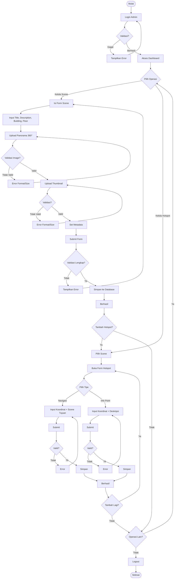
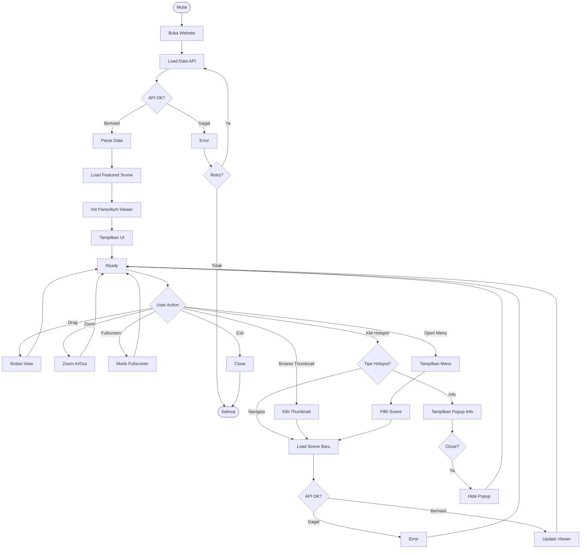

# Activity Diagram - Virtual Tour UNU Yogyakarta

## Diagram Aktivitas

Activity Diagram menggambarkan alur kerja sistem dari dua perspektif: Administrator (pengelolaan konten) dan Pengunjung (navigasi virtual tour).

---

### 1. Proses Administrator



---

### 2. Proses Pengunjung



---

## Penjelasan Singkat

### 1. Proses Administrator

#### A. Login & Autentikasi
- Admin login dengan username/password
- Sistem validasi, jika valid masuk dashboard

#### B. Kelola Scene
1. Isi form: title, description, building, floor
2. Upload panorama 360° (format JPG/PNG, max 10MB, ratio 2:1)
3. Upload thumbnail (format JPG/PNG, max 5MB, ratio 16:9)
4. Set metadata: published date, author, status
5. Sistem validasi dan simpan ke database

#### C. Kelola Hotspot
Dua tipe hotspot:

**Hotspot Navigasi:**
- Input koordinat (pitch: -90° s/d 90°, yaw: -180° s/d 180°)
- Pilih scene tujuan (wajib)
- Input label

**Hotspot Info Point:**
- Input koordinat (pitch & yaw)
- Input label judul
- Input deskripsi konten

#### D. Loop & Exit
- Admin dapat tambah multiple hotspots
- Selesai bisa kembali ke dashboard atau logout

---

### 2. Proses Pengunjung

#### A. Initial Load
1. Buka website → load data dari API
2. Parse data scenes
3. Load featured scene pertama
4. Initialize Pannellum viewer
5. Tampilkan UI (thumbnail gallery, menu)
6. System ready untuk interaksi

#### B. User Interactions

**1. Drag Panorama**
- User drag/swipe → sistem update view

**2. Zoom In/Out**
- Scroll/pinch → sistem update FOV (50° - 120°)

**3. Fullscreen**
- Klik tombol → fullscreen mode

**4. Klik Hotspot**
- **Navigasi**: Load scene baru dari API → update viewer
- **Info**: Tampilkan popup informasi → user close

**5. Browse Thumbnail**
- Klik thumbnail → load scene tersebut

**6. Open Menu**
- Klik menu → pilih scene → load scene

**7. Exit**
- User close browser/tab

---

## Decision Points

### Admin:
- Validasi autentikasi
- Pilih operasi (scene/hotspot)
- Validasi image (format, size)
- Validasi form lengkap
- Tambah hotspot lagi?
- Operasi lain?

### Pengunjung:
- API response OK?
- Retry load?
- User action (multiple paths)
- Tipe hotspot (navigasi/info)?
- Close popup?

---

## Loop Activities

### Admin:
- Loop upload jika validasi gagal
- Loop tambah multiple hotspots
- Loop kembali ke dashboard untuk operasi lain

### Pengunjung:
- Main loop: ready state → interaction → ready state
- Loop retry jika API gagal
- Loop navigasi antar scene

---

## Error Handling

### Admin:
- Login error → ulang login
- Image validation error → ulang upload
- Form validation error → ulang isi form

### Pengunjung:
- API error → tampilkan error, offer retry
- Scene load error → stay di current scene

---

## Success Paths

**Admin Flow:**
```
Login → Dashboard → Add Scene → Upload Images → Submit → Success → Add Hotspot → Success → Logout
```

**Pengunjung Flow:**
```
Open Website → Load Scene → View Panorama → Click Hotspot → Navigate → Explore → Exit
```

---

## Time Estimates

**Admin:**
- Login: ~10 detik
- Upload 1 Scene: ~3-5 menit
- Add 1 Hotspot: ~1-2 menit
- Total (1 scene + 3 hotspots): ~10 menit

**Pengunjung:**
- Initial load: 2-5 detik
- Navigate scene: 1-2 detik
- Explore 5 scenes: ~5-10 menit

---

**Generated:** December 23, 2025  
**System:** Virtual Tour UNU Yogyakarta  
**Version:** 1.0
