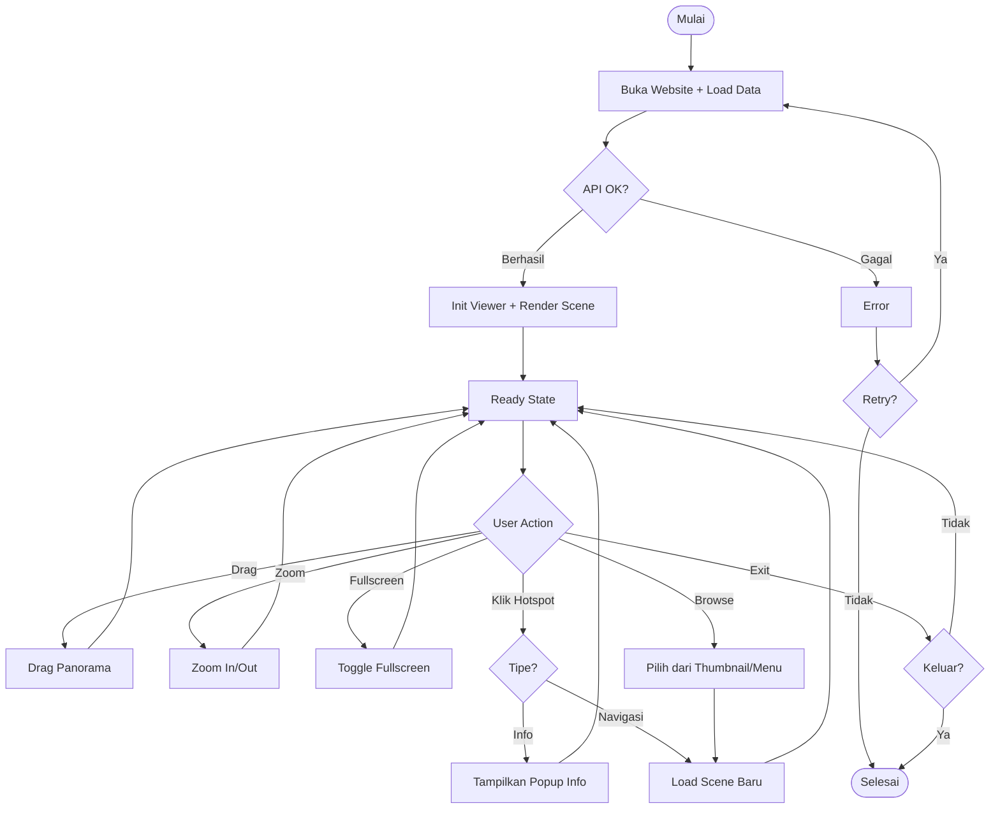

# Activity Diagram - Pengunjung (Ringkas)

## Alur Interaksi Pengunjung

Navigasi virtual tour 360° kampus UNU Yogyakarta.

---

## Flowchart Diagram

---

## Penjelasan Singkat

### 1. Initial Load
**Proses:**
- Buka website → intro animation (2-3 detik)
- Load data dari `GET /api/scenes/`
- Error: tampilkan message + retry option
- Berhasil: parse JSON → load featured scene

**Initialize:**
- Load panorama image
- Init Pannellum viewer dengan hotspots
- Tampilkan UI (thumbnail, menu, controls)

### 2. User Interactions

**A. Drag Panorama**
- Desktop: mouse drag
- Mobile: touch swipe
- Update pitch (vertikal) & yaw (horizontal)
- Smooth animation 60 FPS

**B. Zoom**
- Methods: scroll wheel, +/- buttons, pinch gesture
- Zoom in: kurangi FOV (min 50°)
- Zoom out: tambah FOV (max 120°)

**C. Fullscreen**
- Klik button atau F11
- Browser Fullscreen API
- Exit: ESC

**D. Hotspot**
**Navigasi:**
- Klik → load scene tujuan
- API request → transition → update viewer
- Update UI (thumbnail, title)

**Info Point:**
- Klik → tampilkan popup dengan deskripsi
- Close: klik close button atau di luar popup

**E. Browse**
- Thumbnail gallery: scroll + klik
- Scene menu: grouped by building & floor
- Keduanya load scene baru

### 3. Ready State Loop
- System selalu kembali ke ready state
- Siap terima interaksi berikutnya
- Exit: user close browser

---

## Decision Points

| Decision | Path 1 | Path 2 |
|----------|--------|--------|
| API OK? | Parse data | Error + retry |
| User Action | 7 interaksi | - |
| Zoom | In/Out | - |
| FOV Check | Update | Batas tercapai |
| Tipe Hotspot | Navigasi | Info point |
| API Scene | Load | Error |

---

## Parallel Activities

Dari ready state, user dapat:
- Drag + zoom bersamaan
- View + browse thumbnail
- View + open menu
- Hotspot hover tidak block interaksi lain

---

## Estimasi Waktu

| Aktivitas | Waktu |
|-----------|-------|
| Initial load | 2-5 detik |
| Load scene baru | 1-2 detik |
| Transition | 0.5-1 detik |
| View 1 scene | 30-60 detik |
| **Eksplorasi 5 scenes** | **~5-10 menit** |

---

## Browser Support

| Browser | Version | Support |
|---------|---------|---------|
| Chrome | 90+ | ✅ Full |
| Firefox | 88+ | ✅ Full |
| Safari | 14+ | ✅ Full |
| Edge | 90+ | ✅ Full |
| Mobile | Latest | ✅ Full |

**Requirements:** WebGL, ES6, Fetch API

---

**Generated:** December 23, 2025  
**Role:** Pengunjung  
**System:** Virtual Tour UNU Yogyakarta
