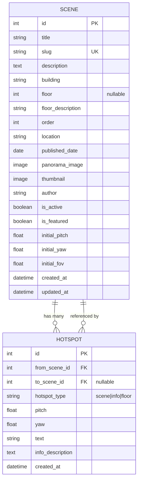

# ERD Database - Virtual Tour UNU Yogyakarta

## Entity Relationship Diagram



## Penjelasan Tabel

### 1. **Scene** (Lokasi Virtual Tour)
Tabel utama yang menyimpan informasi setiap lokasi 360° di kampus.

**Primary Key:**
- `id`: Auto-increment integer

**Unique Constraints:**
- `slug`: URL-friendly identifier yang unik

**Indexes:**
- Composite index pada `(building, floor)`
- Composite index pada `(is_active, is_featured)`

**Fields:**

| Field | Type | Constraint | Description |
|-------|------|------------|-------------|
| `id` | INTEGER | PK, AUTO_INCREMENT | Primary key |
| `title` | VARCHAR(200) | NOT NULL | Nama lokasi (e.g., "Gedung Rektorat") |
| `slug` | VARCHAR(250) | UNIQUE, NOT NULL | URL slug (auto-generated) |
| `description` | TEXT | NOT NULL | Deskripsi lengkap lokasi |
| `building` | VARCHAR(100) | NOT NULL, DEFAULT="Gedung Utama" | Nama gedung |
| `floor` | INTEGER | NULLABLE, CHECK(1-9) | Nomor lantai (1-9), NULL untuk outdoor |
| `floor_description` | VARCHAR(200) | NULLABLE | Deskripsi singkat lantai |
| `order` | INTEGER | NOT NULL, DEFAULT=0 | Urutan tampilan dalam lantai yang sama |
| `location` | VARCHAR(100) | NOT NULL, DEFAULT="Yogyakarta" | Lokasi kota/kabupaten |
| `published_date` | DATE | NOT NULL | Tanggal publikasi |
| `panorama_image` | VARCHAR(100) | NOT NULL | Path foto 360° (equirectangular 2:1) |
| `thumbnail` | VARCHAR(100) | NOT NULL | Path thumbnail (16:9 landscape) |
| `author` | VARCHAR(100) | NOT NULL, DEFAULT="Tim Virtual Tour UNU" | Nama fotografer |
| `is_active` | BOOLEAN | NOT NULL, DEFAULT=TRUE | Status aktif tampil di tour |
| `is_featured` | BOOLEAN | NOT NULL, DEFAULT=FALSE | Jadikan starting point |
| `initial_pitch` | FLOAT | NOT NULL, DEFAULT=0 | Sudut vertikal awal (-90 to 90) |
| `initial_yaw` | FLOAT | NOT NULL, DEFAULT=0 | Sudut horizontal awal (-180 to 180) |
| `initial_fov` | FLOAT | NOT NULL, DEFAULT=90 | Field of view awal (50-120) |
| `created_at` | DATETIME | NOT NULL, AUTO_NOW_ADD | Timestamp pembuatan |
| `updated_at` | DATETIME | NOT NULL, AUTO_NOW | Timestamp update terakhir |

**Ordering Default:**
```sql
ORDER BY building, floor, order, title
```

**Business Rules:**
- Hanya boleh ada 1 scene dengan `is_featured=TRUE` (sebagai starting point)
- `floor` harus antara 1-9 atau NULL untuk area outdoor
- `slug` otomatis di-generate dari `title` jika kosong

---

### 2. **Hotspot** (Navigasi & Info Point)
Tabel untuk menyimpan hotspot navigasi dan info point dalam setiap panorama.

**Primary Key:**
- `id`: Auto-increment integer

**Foreign Keys:**
- `from_scene_id` → `scene.id` (CASCADE on delete)
- `to_scene_id` → `scene.id` (CASCADE on delete, NULLABLE)

**Fields:**

| Field | Type | Constraint | Description |
|-------|------|------------|-------------|
| `id` | INTEGER | PK, AUTO_INCREMENT | Primary key |
| `from_scene_id` | INTEGER | FK, NOT NULL | Scene yang memiliki hotspot ini |
| `to_scene_id` | INTEGER | FK, NULLABLE | Scene tujuan (wajib jika type=scene) |
| `hotspot_type` | VARCHAR(10) | NOT NULL, DEFAULT='scene' | Tipe: scene, info, floor |
| `pitch` | FLOAT | NOT NULL | Sudut vertikal (-90 to 90) |
| `yaw` | FLOAT | NOT NULL | Sudut horizontal (-180 to 180) |
| `text` | VARCHAR(100) | NOT NULL | Label hotspot |
| `info_description` | TEXT | NULLABLE | Deskripsi detail (untuk type=info) |
| `created_at` | DATETIME | NOT NULL, AUTO_NOW_ADD | Timestamp pembuatan |

**Ordering Default:**
```sql
ORDER BY from_scene_id, hotspot_type
```

**Hotspot Types:**
1. **`scene`**: Navigasi ke scene lain
   - `to_scene_id` WAJIB diisi
   - Digunakan untuk berpindah antar lokasi

2. **`info`**: Info point statis
   - `info_description` berisi konten informasi
   - Menampilkan popup info saat diklik

3. **`floor`**: Floor navigation (perpindahan lantai)
   - `to_scene_id` menunjuk ke scene di lantai lain
   - Khusus navigasi vertikal antar lantai

**Business Rules:**
- Jika `hotspot_type='scene'`, maka `to_scene_id` TIDAK BOLEH NULL
- `pitch` harus antara -90 hingga 90
- `yaw` harus antara -180 hingga 180

---

## Relationships

### 1. Scene → Hotspot (One-to-Many)
**Relationship:** `Scene.hotspots`
- Satu scene bisa memiliki banyak hotspot
- Cascade delete: hapus scene akan hapus semua hotspotnya

```python
from_scene.hotspots.all()  # Get semua hotspot dari scene ini
```

### 2. Scene ← Hotspot (Many-to-One)
**Relationship:** `Scene.incoming_hotspots`
- Satu scene bisa direferensi oleh banyak hotspot dari scene lain
- Berguna untuk mengetahui scene mana saja yang link ke scene ini

```python
to_scene.incoming_hotspots.all()  # Scene mana saja yang link ke sini
```

---

## Database Queries Examples

### Get semua scene aktif yang diurutkan berdasarkan gedung dan lantai
```python
Scene.objects.filter(is_active=True).order_by('building', 'floor', 'order')
```

### Get featured scene (starting point)
```python
Scene.objects.filter(is_featured=True).first()
```

### Get semua scene di gedung tertentu dan lantai tertentu
```python
Scene.objects.filter(building='Gedung A', floor=2)
```

### Get semua hotspot navigasi dari sebuah scene
```python
scene.hotspots.filter(hotspot_type='scene')
```

### Get semua info points dari sebuah scene
```python
scene.hotspots.filter(hotspot_type='info')
```

### Get scene yang paling banyak direferensi (popular destinations)
```python
from django.db.models import Count
Scene.objects.annotate(
    incoming_count=Count('incoming_hotspots')
).order_by('-incoming_count')
```

---

## Sample Data Structure

### Scene Example:
```json
{
  "id": 1,
  "title": "Gerbang Utama UNU Yogyakarta",
  "slug": "gerbang-utama-unu-yogyakarta",
  "building": "Area Luar",
  "floor": null,
  "order": 0,
  "is_featured": true,
  "panorama_image": "/media/panoramas/gerbang-utama.jpg",
  "thumbnail": "/media/thumbnails/gerbang-utama-thumb.jpg"
}
```

### Hotspot Example (Scene Navigation):
```json
{
  "id": 1,
  "from_scene_id": 1,
  "to_scene_id": 2,
  "hotspot_type": "scene",
  "pitch": -10,
  "yaw": 45,
  "text": "Ke Gedung Rektorat"
}
```

### Hotspot Example (Info Point):
```json
{
  "id": 2,
  "from_scene_id": 1,
  "to_scene_id": null,
  "hotspot_type": "info",
  "pitch": 0,
  "yaw": 90,
  "text": "Info Gerbang",
  "info_description": "Gerbang utama ini diresmikan pada tahun 2020..."
}
```

---

## Database Schema (SQL)

```sql
-- Scene Table
CREATE TABLE tour_api_scene (
    id INTEGER PRIMARY KEY AUTOINCREMENT,
    title VARCHAR(200) NOT NULL,
    slug VARCHAR(250) UNIQUE NOT NULL,
    description TEXT NOT NULL,
    building VARCHAR(100) NOT NULL DEFAULT 'Gedung Utama',
    floor INTEGER CHECK(floor >= 1 AND floor <= 9),
    floor_description VARCHAR(200),
    "order" INTEGER NOT NULL DEFAULT 0,
    location VARCHAR(100) NOT NULL DEFAULT 'Yogyakarta',
    published_date DATE NOT NULL,
    panorama_image VARCHAR(100) NOT NULL,
    thumbnail VARCHAR(100) NOT NULL,
    author VARCHAR(100) NOT NULL DEFAULT 'Tim Virtual Tour UNU',
    is_active BOOLEAN NOT NULL DEFAULT 1,
    is_featured BOOLEAN NOT NULL DEFAULT 0,
    initial_pitch REAL NOT NULL DEFAULT 0,
    initial_yaw REAL NOT NULL DEFAULT 0,
    initial_fov REAL NOT NULL DEFAULT 90,
    created_at DATETIME NOT NULL,
    updated_at DATETIME NOT NULL
);

-- Indexes for Scene
CREATE INDEX idx_scene_building_floor ON tour_api_scene(building, floor);
CREATE INDEX idx_scene_active_featured ON tour_api_scene(is_active, is_featured);

-- Hotspot Table
CREATE TABLE tour_api_hotspot (
    id INTEGER PRIMARY KEY AUTOINCREMENT,
    from_scene_id INTEGER NOT NULL,
    to_scene_id INTEGER,
    hotspot_type VARCHAR(10) NOT NULL DEFAULT 'scene',
    pitch REAL NOT NULL,
    yaw REAL NOT NULL,
    text VARCHAR(100) NOT NULL,
    info_description TEXT,
    created_at DATETIME NOT NULL,
    FOREIGN KEY (from_scene_id) REFERENCES tour_api_scene(id) ON DELETE CASCADE,
    FOREIGN KEY (to_scene_id) REFERENCES tour_api_scene(id) ON DELETE CASCADE
);

-- Index for Hotspot
CREATE INDEX idx_hotspot_from_scene ON tour_api_hotspot(from_scene_id);
CREATE INDEX idx_hotspot_to_scene ON tour_api_hotspot(to_scene_id);
```

---

## Diagram Versi Sederhana (Text-based)

```
┌──────────────────────────────┐
│         SCENE                │
├──────────────────────────────┤
│ • id (PK)                    │
│ • title                      │
│ • slug (UK)                  │
│ • description                │
│ • building                   │
│ • floor                      │
│ • panorama_image             │
│ • thumbnail                  │
│ • is_active                  │
│ • is_featured                │
│ • ...                        │
└──────────────────────────────┘
         │ 1
         │
         │ has many
         │
         ▼ *
┌──────────────────────────────┐
│        HOTSPOT               │
├──────────────────────────────┤
│ • id (PK)                    │
│ • from_scene_id (FK) ────────┼─────┐
│ • to_scene_id (FK) ──────────┼─────┘ (self-reference)
│ • hotspot_type               │
│ • pitch                      │
│ • yaw                        │
│ • text                       │
│ • info_description           │
└──────────────────────────────┘
```

---

## Notes

- **Database Engine**: SQLite (development), PostgreSQL (production recommended)
- **ORM**: Django ORM
- **Cascade Delete**: Menghapus Scene akan otomatis menghapus semua Hotspot terkait
- **Multi-floor Support**: System mendukung navigasi multi-lantai dengan field `building` dan `floor`
- **Featured Scene**: Hanya 1 scene yang boleh jadi `is_featured=True` sebagai starting point

---

**Generated:** December 23, 2025  
**Database Version:** Django 5.2.7  
**Project:** Virtual Tour UNU Yogyakarta
